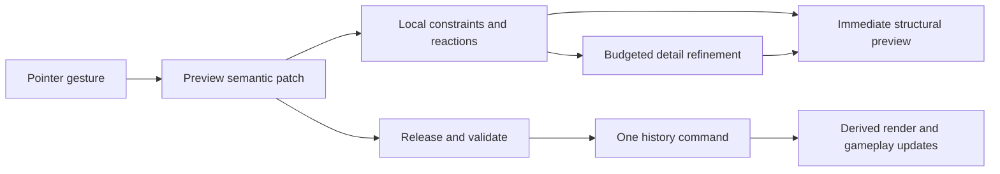

# Phase 11 — Wall appearance and building experience

Date: 2026-09-27  
Status: Proposed; implementation has not started  
Scope: Live wall construction and matching workshop walls  
Predecessor: [Rounded fieldstone](phase-10-rounded-fieldstone.md)

## 1. Product target

Make wall building feel like drawing something that immediately becomes a believable little structure. A player chooses the route, height, thickness and character; the system handles stone fitting, ends, joins, caps and ground contact.

The first useful result should take one drag. The first courtyard should take about a minute. Further editing should be inviting: the wall stays recognizable, handles explain themselves, and undo reliably restores its shape and appearance.

This is the next quality pass over the existing builder. Phases 2–10 already delivered many of the mechanics. This plan defines how they should work together, what still needs implementation, and how to judge the result.

### Relationship to the architecture plan

Follow the [workshop geometry framework](../../architecture/workshop-geometry-framework.md), its [implementation plan](../workshop-geometry-framework-plan-2026-08-19.md), and the [public behavior review](../../research/tiny-glade-workshop-behavior-review-2026-08-19.md). The wall work below exercises framework phases 5–9, with bounded ground-contact and decoration work from phases 12–13. Existing framework phases 1–4 provide useful foundations; inspect their contracts before extending them.

Keep the current live editor and workshop. Share wall semantics and planners as capabilities move across. New automatic joins, openings and decoration belong to the resolved model. Generated geometry remains disposable.

## 2. What the references establish

### External evidence

The supplied [OP Game Marketing article](https://opgamemarketing.substack.com/p/tiny-glade-an-indie-game-by-2-devs), published August 7, 2024, emphasizes consistent presentation, communicating the experience through visible interactions, and early playtesting. For this work, the practical lesson is to judge a short building session as well as the finished image. Its marketing discussion supplies no wall algorithm.

The [official Steam description](https://store.steampowered.com/app/2198150/Tiny_Glade/) describes gridless construction that assembles detail around edits, including doors arising from paths and supports appearing under raised buildings. That establishes a useful behavior target: ordinary edits should produce coherent surroundings automatically.

In the [developers’ interview with 80 Level](https://80.lv/articles/exclusive-tiny-glade-developers-discuss-bevy-proceduralism-publishers-cozy-games), Opara and Stachowiak describe repeated UX iterations and several specialized procedural systems. This supports implementing and testing a small set of satisfying interactions before expanding the feature set.

The design and algorithms below are proposals for this repository. They do not claim to reproduce Tiny Glade’s private implementation or exact controls.

### Reading the four supplied images

| Reference | Visible qualities | Requirement for our walls |
| --- | --- | --- |
| Stone wall on a dark background | Legible individual blocks, modest rounding, mixed proportions, staggered joints, uneven silhouette | The masonry must read well under neutral lighting with vegetation hidden |
| Curved courtyard with a white guide and scissors | Continuous curved structure, warm sunlit faces, sparse contextual controls, ivy concentrated in patches | Keep attention on the shape; show the affected curve and cut directly in the scene |
| Close view of a curved crenellated wall | Real top thickness, darker recesses, readable merlons, restrained moss/ivy | Caps, tops, inner faces and shadows need the same quality as the outer facade |
| Rounded and angular enclosures | A consistent stone language across different outlines, believable interior faces and exposed ends | Straight, curved, open and closed walls must use the same construction system |

The images suggest a hierarchy: overall silhouette, individual stone mass, joints and edge highlights, then weathering and vegetation. Tune in that order. Color and grass alone cannot establish the stone shapes.

## 3. Current implementation and concrete gaps

This inventory comes from source inspection on September 27. Existing QA reports describe earlier results; this planning task did not run a new interactive or performance baseline.

| Area | Existing foundation | Work this plan adds |
| --- | --- | --- |
| Drawing | `EditorController` fits freehand strokes to cubic paths | Continuous drawing, immediate loop closure, clear shape choices, bounded smoothing |
| Editing | Anchor/tangent editing, insertion, direct height/thickness/move handles | One interaction policy, wall-body bending, clear whole-wall versus local height editing |
| Snapping | `CurveSnapping` supports anchors, curves, straightening, grid and bearings | Screen-distance acquisition, hysteresis, nearest-candidate ranking, optional grid, durable joins |
| Masonry | Course lattice, rounded mesher, typed-array writer, footing and coping | Art tuning, full opening masks, coherent cell identity through edits, workshop reuse |
| Tops | Flat, irregular, crenellated and ruined | Clear visual previews, stable pattern phase and continuous loop seams |
| Openings | Cut strokes, authored features, dressings, collision compilation | Live cut preview, precise contour clipping, persistent path reactions |
| Appearance UI | Three-ring palette and advanced inspector | Small initial choice set, visible Look entry point, grouped choices and complete preset access |
| Preview | Fast draft shell; committed masonry built afterward | Persistent preview buffers and local replacement while unaffected masonry stays visible |
| Rendering | Hash-based module reconciliation, worker planning, build queue, LOD | Fine-grained dirty ranges, equivalent structural masks in all tiers, measured refinement latency |
| Workshop framework | Semantic document, transactions/history, curves, relationships, spatial indexing | The shared semantic wall/opening slice and resolved reaction rules |

### Findings to turn into baseline scenarios

1. **Drawing stops after one wall.** `onConstructionPointerUp` sets `constructionMode = 'edit'`. Drawing several walls currently requires returning to draw mode.
2. **A full loop can fail the length check.** Creation checks the distance between the first and last stroke samples against 0.5 m. A long stroke returning to its start can therefore be rejected. Measure stroke length separately from endpoint proximity and test closure before minimum-length rejection.
3. **Cutting has no preview.** `onConstructionPointerMove` returns immediately for a cut stroke. The opening appears only when committed.
4. **Reshaping hides the full wall.** `ConstructionView.setDraft` hides the record’s group and creates a new draft mesh. `clearDraft` disposes that mesh each time. This breaks visual continuity and adds allocation work.
5. **Ctrl has inconsistent meanings.** Anchor dragging uses Ctrl to suppress snapping; height/thickness dragging uses it to enable quantization. Adopt one rule across wall gestures.
6. **Snapping includes a hidden grid.** `CurveSnapping` includes a 0.5 m grid and fixed 0.75 m world radius. Curve candidates return the first acceptable other path. Default gridless behavior needs explicit candidate ranking and zoom-aware thresholds.
7. **Position snapping does not establish a lasting wall relationship.** The inspected live schema/commands store path geometry and features. Persisted semantic join intent and shared join resolution need to be added through the framework.
8. **Opening cuts use one height per course.** `CurvedCoursePacker` calls `survivingIntervals` at the course center. The [phase 10 notes](phase-10-rounded-fieldstone.md#known-limits) also record stones intruding near sills and arch crowns.
9. **Seed stability is only part of the solution.** The packer has stable shaping fields, but span packing consumes a random stream and numbers cells after opening-dependent packing. Verify whether insertion, splitting and length changes disturb unaffected stones before promising temporal coherence.
10. **World/workshop stone shapes differ.** Phase 10 records rounded live walls and prism-based workshop walls. Share the proven mesher through a semantic surface plan.
11. **The initial material list is truncated.** `ConstructionPaletteController.materialPresets()` takes the first eight presets. Add an explicit browser for the complete collection and custom materials.

Two cached images inspected in `tmp/construction-rounded-qa/` were written on September 24, before the September 26 lighting follow-up. They are historical evidence only. Fresh captures must establish present shading quality; do not use those images to justify reversing the lighting fix.

## 4. The first minute of building

### Recommended default flow

1. Choose **Wall**. A small strip offers **Draw**, **Shape**, **Opening**, and **Look**. Draw starts active with a warm stone preset and a modest enclosure height.
2. Drag on empty ground. A solid, softly shaded wall grows under the pointer. Release to keep it. Wall remains the active tool, ready for another stroke.
3. Return a stroke to its start. A small join cue previews closure. Release to make a courtyard with an empty interior and a continuous top.
4. Hover the wall. Its curve and a few relevant handles appear. Drag the top handle upward; additional courses appear locally while existing stones keep their character.
5. Choose **Opening** and drag across the wall. The arch-shaped gap and its width are visible before release. Commit creates a usable passage.
6. Choose **Look**, preview a warm limestone or mossy finish, and select a top treatment. Escape closes the choices. Undo restores the previous result in one step.

The courtyard flow needs no numeric input, tangent editing, material import, or advanced inspector. Those controls remain available for precise work.

### Defaults to prototype

These are proposed starting values in world meters, subject to character scale, art review and playtesting. They are not measured Tiny Glade values.

| Preset | Height | Thickness | Top | Intended use |
| --- | ---: | ---: | --- | --- |
| Garden wall | 1.2 | 0.45 | Soft uneven coping | Low boundaries and gardens |
| Courtyard wall — initial choice | 2.4 | 0.65 | Capped | Enclosures like the supplied references |
| Castle wall | 4.0 | 1.0 | Battlements | Taller fortifications; walkability checked separately |

Keep these as named parameter presets over the same wall model. Remember the player’s latest choices within the session. Existing saved walls retain their authored dimensions and style. A connected extension inherits its host’s appearance, with height changes shown in preview.

## 5. Interaction specification

### 5.1 Pointer behavior

| Target/action | Result | Feedback and escape |
| --- | --- | --- |
| Drag empty ground | Draw a freehand wall | Width footprint and solid preview; Escape cancels |
| Shape → Line, then drag | Exact straight wall | End markers and length while dragging |
| Shape → Circle, then drag | Closed circular wall | Radius/diameter during drag; editable afterward |
| Shape → Rectangle, then drag | Closed rectangle with crisp corners | Width/depth during drag; editable afterward |
| Hover existing wall | Expose a small set of contextual controls | Thin cream guide, legible over both sun and shade |
| Click wall | Select it and show its action strip | A ground click clears selection without leaving Wall |
| Drag an endpoint’s Extend handle | Continue the existing wall | Inherited style, continuous courses, one undo step |
| Drag a visible anchor | Reshape the path | Neighboring span and snap target highlighted |
| Drag between anchors using the Bend handle | Bow the span | Add a semantic control point only when needed; preserve distant spans |
| Double-click curve / choose Add point | Insert a control point | Initial shape stays identical |
| Drag whole-wall height handle | Raise/lower the complete top profile | Absolute height shown; profile variation preserved |
| Choose Shape top and drag a local top handle | Raise/lower a bounded top region | Visible falloff extent; wheel changes extent only during this action |
| Drag width handle | Change thickness symmetrically about the centerline | Both faces preview; openings retain their host positions |
| Drag Move handle | Translate selected wall | Attached authored features follow; neighboring join reactions preview |
| Drag with Opening active | Create or resize a cut | Real opening silhouette, lintel/arch and clear passage preview |
| Select wall → Trim, then drag along its curve | Remove a bounded length or shorten an end | Scissors and highlighted removal interval; one undo restores it |
| Right-click wall / click Look | Open appearance choices | Pointer and keyboard accessible; selecting commits once |
| Delete selected control point | Remove that point if topology remains valid | Preserve hosted features through remapping where possible |
| Delete selected wall | Delete that wall and owned authored features | Neighboring ends resolve; undo restores the complete edit |

Press-and-drag on a clearly shown handle owns the gesture until release. Once a drag starts, passing across another wall cannot change its meaning. A short click and a drawing drag use a small screen-distance threshold, so selection does not accidentally create a wall.

Starting on a wall body selects/reshapes it. Drawing from it uses the visible Extend handle or an explicit new-branch action. This makes the choice between editing and drawing predictable.

### 5.2 Keyboard, camera and accessibility

- **Ctrl temporarily disables snapping everywhere in the wall tool.** Step snapping, if desired, becomes an explicit toggle. Keep Ctrl+Z/Ctrl+Y history shortcuts and ignore shortcuts while text fields have focus.
- **Shift gives finer motion** during height, width, move and shape adjustments. It does not switch to another tool.
- **Escape unwinds one level:** cancel active drag, close submenu, close appearance menu, clear selection, then leave the tool. Use the existing `EscapeStack`.
- **Undo/redo:** one press reverses one completed gesture, including its dependent automatic changes. A canceled gesture adds no history entry.
- Preserve existing camera orbit/pan bindings. A right-button drag remains camera movement; only a short right click opens Look. Menus near screen edges reposition into the viewport.
- Provide visible buttons for cut, snapping, precision values and Add point. Alt-cut can remain a shortcut, but must not be required.
- Use constant screen-size handles with larger invisible hit regions. Prototype 32–44 CSS-pixel targets and verify at 100%, 150% and 200% UI scale.
- Use icons plus text labels on hover/focus. Shape, pattern and text identify snap/selection states alongside color.
- Offer a list/grid alternative to radial navigation, keyboard focus, reduced motion and separate construction-sound volume.
- In paused player editing, use the active player camera and the same tools. Pause/menu ownership must stay with the existing mode controllers. Resume only after a completed or canceled edit has a valid collision representation.

### 5.3 Drawing and snapping

**Stroke processing:** sample by pointer distance and geometric error, simplify small hand jitter, and retain deliberate corners. Freeze completed portions of the stroke while fitting its moving tip. Do not refit the entire curve on every sample. Line/circle/rectangle tools provide exact shapes without asking the user to draw them perfectly.

**Closure:** combine a screen-distance cue with a minimum usable loop perimeter/area. A closed path needs a single logical seam and valid thickness offsets. Small closure adjustments appear in preview before commit.

**Candidate priority:** explicit join/closure, endpoint, nearest curve, alignment, then optional grid/angle constraints. Within a priority, rank by screen distance and use stable entity IDs as the tie-breaker. Query the spatial neighborhood first.

**Hysteresis:** start tuning at approximately 10–14 CSS pixels to acquire a snap and 18–22 to release it. Convert through the camera into a bounded local query radius. Show the actual curved target and retain it until the release threshold is crossed. These are UX hypotheses to test at several zoom levels.

**Grid policy:** free placement is the default. The precision panel can enable the existing grid and angular increments visibly.

**Difficult geometry:** repair a tiny segment or nearly coincident endpoint when the preview communicates the correction. For a self-crossing stroke, show the affected crossing and a last-valid preview. Offer a junction/split once supported; never silently discard the entire drawing or invent a different wall. Very tight bends preview their feasible thickness or rounded corner fallback before release.

### 5.4 Trimming, copying and recovery

Trimming a wall section and cutting an opening need different previews. **Trim** highlights the full section to remove, including its top; **Opening** shows the bounded doorway/window contour. The scissors action must identify which operation is active.

Dragging from an end shortens the wall. Removing an interior interval creates two semantic wall runs, finishes their exposed ends and remaps surviving openings/top points. Features entirely inside the removed interval are included in the removal preview. Crossing features receive an explicit local adjustment preview; they cannot disappear without feedback. Cancel restores everything, and the whole trim is one history command.

Offer **Duplicate** and **Match look** in the selection menu. A duplicate receives fresh authored IDs while preserving the chosen appearance; moving it cannot alter the source. Match look copies/inherits only appearance choices and leaves dimensions and shape intact. Multi-selection can follow the core release; basic courtyard construction must work without it.

## 6. Art specification

### 6.1 Stone shape and arrangement

Target hand-set masonry with broad faces and softened edges. Retain enough angular structure that blocks read as stone. The rounded mesher is a useful base, but every stone having an equally inflated face or capsule outline makes the wall look padded.

| Layer | Direction | Acceptance at ordinary building zoom |
| --- | --- | --- |
| Wall silhouette | Gentle variation, readable top thickness, purposeful caps and ends | Looks like one continuous built wall |
| Large stones | Mix wide, square and occasional narrow blocks; larger grounding stones | Repetition is hard to spot over a 10 m run |
| Courses | Broadly aligned beds, staggered vertical joints, bounded local splitting | No zipper of stacked vertical joints or repeated module rectangles |
| Faces | Broad planar/slightly bulged faces, unequal corner softness, sparse chips | Stone mass remains readable in diffuse light |
| Joints | Narrow, variable, recessed warm mortar | Crevices separate stones without a dark outline around every block |
| Edge highlights | Rounded/faceted bevels with subdued rough highlights | Corners catch light without a plastic sheen |
| Palette | Warm gray, cream, muted ochre, a few cooler stones | Variations belong to one material family |
| Weathering | Broad stains and local moss, then faint grain | Detail supports the masonry rather than hiding it |

Prototype a reference limestone look using roughly 0.30–0.45 m courses and 0.45–0.90 m typical stone widths. Compare it with the current rounded-fieldstone defaults of 0.50 m and 0.95 m. Smaller stones increase geometry; select the scale jointly with the performance budget and the default camera distance.

Tune these controls independently: course irregularity, block proportions, face bulge, edge radius, corner shape, depth offset, joint width and color variation. A single “randomness” slider cannot express their different effects. Present a few finished looks to players; keep the underlying parameters in the existing YAML/style configuration.

Review A/B swatches for reduced corner rounding and reduced bulge while retaining the existing useful rim lighting. Change one family of parameters per comparison. Keep arch stones and capstones somewhat crisper than field stones.

### 6.2 Curves, thickness, corners and wall ends

- Place masonry in wall-local arc-length/height coordinates. Derive both faces from the same structural envelope.
- Adjust block lengths on tight curves and fit wedge-shaped pieces where needed. Use curvature limits to prevent inner-face overlaps and tiny slivers.
- A thin wall can use through-stones. Thick walls need sensible face stones, core fill and top coverage; increasing thickness must not turn every stone into an implausibly deep brick.
- Resolve L, T and crossing joins as shared local regions: remove interior faces, choose coherent corner stones, and connect cap/merlon patterns. Decorative meshes overlapping at the join are insufficient.
- At an exposed end, close the core with terminal stones and a proper top. Removing a branch restores that finish automatically.
- At a closed-loop seam, reconcile course offsets and caps in a bounded seam region. Stretching one arc must not repack the whole circumference.
- Preserve authored style boundaries. Compatible neighbors can share treatment; incompatible materials use a legible transition pier or seam selected by a deterministic rule.

### 6.3 Tops

Offer four readable choices: **Capped**, **Uneven**, **Battlements**, **Ruined**. Preserve the existing internal top-style vocabulary through presentation mapping.

- **Capped:** distinct coping stones with modest overhang and end/corner returns.
- **Uneven:** low-frequency height variation with individual top stones that remain supported.
- **Battlements:** evenly legible gaps, variation within a restrained range, and a stable phase through edits. Small loops reduce repetition count cleanly.
- **Ruined:** a few coherent missing regions and stepped breaks. Use the existing support resolver so unsupported floating stones disappear deterministically.

Height editing appends/removes upper courses while preserving unaffected lower cells. A transition to a different top treatment previews cap removal, merlon placement and affected openings. Keep user-authored height profiles when switching treatments where they remain meaningful.

### 6.4 Grounding, vegetation and aging

Ground contact is visible from both sides. Sample both edges and the centerline; sink footing stones enough to close small gaps. Larger grade changes use a foundation or stepped courses according to the chosen profile. A cliff must not stretch a decorative bottom stone arbitrarily far.

Start with **Fresh**, **Weathered**, and **Overgrown** as appearance recipes. An optional Age slider blends weathering and decoration density; structural ruin remains an explicit top/damage choice so aging a wall does not unexpectedly remove masonry.

- Moss favors shaded/damp lower joints and protected recesses.
- Ivy starts at a few stable root anchors, climbs in clusters and leaves substantial bare stone visible.
- Dirt/plaster wear follows broad surface fields and edges, avoiding a uniform noise overlay.
- Small grass tufts and occasional stones can soften the footing. Grass is cleared from the structural core and usable passage.
- Doorways, windows, path crossings, interaction areas and walkable tops publish exclusion masks for every decoration system.
- Allow a local **Clear growth** action, stored as a suppression, and **Restore automatic growth**. Editing ivy must leave stone layout unchanged.

Reuse `ProceduralWorkshopIvy` where its inputs can consume shared semantic surfaces and masks. Batch vegetation and restrict fine leaves to close range. Avoid persistent scene objects for every leaf or stone.

### 6.5 Lighting and camera

Use neutral, overcast and warm side-lit test scenes. Neutral light exposes geometry problems; warm light evaluates the desired final mood. Keep the world/workshop ACES exposure agreement documented in the earlier phases. Tuning a wall material must not require an unreviewed global exposure or tone-mapping change.

Require readable shaded stone, soft contact shadows and gentle color bounce consistent with the scene. Inspect the existing sky-ambient fix before changing cool shadows. Avoid baked directional highlights that stay fixed when the sun moves.

Add an optional wall-focused camera framing command and a clean capture view. Keep depth of field off during construction; narrow focus is an optional capture effect. Review at both the elevated building camera and player eye level.

## 7. Openings and automatic connections

### 7.1 Two distinct sources of opening intent

**Explicit opening:** choosing Opening or drawing a cut creates an authored hosted feature. Moving, resizing or deleting it acts directly on that feature.

**Path crossing:** a persistent semantic path intersecting a wall proposes an automatic opening in the resolved layer. Moving/removing the path updates/removes that opening unless the player keeps it as an authored feature. The current one-shot cut stroke is not a persistent path relationship; implementing this reaction requires the path host adapter and provenance.

Drawing another wall across a wall creates a junction candidate. It must not be mistaken for a pedestrian path and carve an unwanted doorway.

### 7.2 Expected reactions

| Edit | Automatic response | Player control |
| --- | --- | --- |
| Extend/connect wall | Join ends, resolve corner/core/caps, inherit compatible style | Ctrl avoids connection; explicit detach remains available |
| Close loop | Resolve seam and remove terminal treatments | Open loop command restores ends |
| Path crosses wall | Propose a passage aligned to path width and clearance | Keep opening, suppress opening, reset to automatic |
| Move authored opening | Recut masonry, move trim, update clearance and gameplay | User-selected opening role/profile wins |
| Lower wall onto arch crown | Preview a valid lower opening or an open-topped gap | Explain the proposed adjustment; explicit locked profile stays constrained |
| Reshape wall | Reproject hosted openings and decoration anchors | If fit fails, show the affected feature; do not silently delete it |
| Remove a wall branch | Restore the remaining wall’s terminal/corner treatment | One undo restores the branch and prior join |
| Change terrain locally | Refresh footing, nearby contact and plant masks | Explicit level-top/follow-ground choice remains authored |

### 7.3 Precise cuts

Publish one opening contour in the wall’s surface domain. Use it for near masonry, coarse masonry, shell, mortar core, selection proxy, collision, portal and vegetation exclusion.

For each affected stone cell:

1. Intersect its full 2D face polygon with the opening contour, including sill and arch crown.
2. Split/crop surviving regions and apply a minimum-piece policy.
3. Repack or merge tiny fragments within the local repair window.
4. Build reveals, jambs and the cap/lintel/arch surround.
5. Validate that rounding, bulge and protrusion still stay outside the clear opening volume. Clipping only the undeformed cell is insufficient.

For curved walls, project the contour through both faces and close the reveals. Maintain consistent portal and collision clearance after deformation. A shell or mortar fallback must never fill the visible arch while detailed geometry is loading.

The minimum-piece policy may adjust local joints or choose a dressed surround. It must not widen the passage beyond authored constraints or leave unsupported fragments.

## 8. Responsive previews, motion and sound

The existing rule that preview must stay independent of expensive masonry remains. Improve the visual feedback within that constraint.



### Preview policy

- Allocate preview buffers once and update changed ranges. Keep unaffected committed modules visible.
- Show current thickness, top profile, openings, joins and ground contact immediately at shell quality.
- Retain/deform compatible cached stone cells where cheap; otherwise use a matching opaque shaded shell for the changed span. Offer an outline only as an additional guide.
- Schedule masonry refinement after a short pointer pause or at available frame budget, then finish after release. Never synchronously rebuild the full wall in the pointer handler.
- Use a stable preview seed and provisional entity ID that carry through commit. Committing a wall must not reroll its appearance.
- Tag work with document revision, transaction ID and preview sequence. A late worker response must not resurrect an older shape after undo, cancel, deletion or a newer drag.
- Keep the preview until the replacement render product is ready. Swap/crossfade a local region without a blank frame, double wall or mismatch in opening silhouette.
- If detail generation fails, retain valid authored state and a usable structural fallback; report diagnostics for the failing region.

### Feedback

Prototype handle fades of roughly 100–150 ms and local detail settling of 120–220 ms. These are animation starting points, not delays added before showing an edit. Reduced-motion mode uses immediate state changes.

Use subtle stone placement sounds on meaningful distance/course increments, with limited variation and a strict event rate. A join receives one soft confirmation; an invalid edit receives a brief visual explanation. Sounds must not fire for every generated block or every pointer event. Keep optional dust sparse and outside the core readability path.

## 9. Implementation architecture and ownership

### 9.1 Reuse and migration boundary

The live builder currently uses `ConstructionStore`/`ConstructionCommands`; the workshop has `WorkshopDocument`/`WorkshopCommandBus`. Avoid adding another mutable wall document or duplicating history between them.

For the upgraded wall capability:

1. Add a pure adapter from existing construction records to the framework’s curve, wall, top, style and opening semantics. Establish fixture parity before changing ownership.
2. Add the shared wall planner and resolved outputs through existing workshop extension points. The live renderer can initially consume its projected construction plan.
3. Move upgraded wall authoring to the semantic command/preview/history path as one bounded capability. `ConstructionStore` becomes the world indexing/compatibility projection for those walls; it cannot independently mutate the same authored fields.
4. Route the live editor’s undo/redo entry to the semantic transaction once. Keep the current live renderer, worker client and LOD integration behind adapters during the change.
5. Route workshop walls through the same planner and masonry builder. Retire each obsolete wall branch after parity is demonstrated.

A standalone live wall can begin as a single-wall definition and instance. Joining independent instances records a semantic connection in the containing construction document; it does not mutate a shared definition used elsewhere. When editing a shared definition, make the editing scope clear. This work must establish that scope before enabling connections between reusable assets.

Migration is limited to construction/workshop data needed for this capability. Follow the framework’s existing schema/version conventions and preserve current wall saves. Azgaar terrain IDs and terrain persistence are outside this feature.

### 9.2 Authored and derived data

| Authored, persisted | Resolved or derived, rebuildable |
| --- | --- |
| Stable wall/path/node/segment IDs and definition seed | Sampled curves and arc tables |
| Curve shape, closure, height/profile, thickness, ground-contact policy | Offset envelopes, join patches, foundation contacts |
| Style/material references and local overrides | Inherited style decisions and material regions |
| Explicit hosted openings and join/attachment intent | Automatic path openings and corner treatments |
| Keep/suppress/reset decisions for automatic output | Stone cells, trim, ivy anchors and meshes |
| Versioned schema and generation policy references | Collision/navigation/portal/cover plans and LOD |

Automatic results carry source IDs, rule/version, stable derivation key and ownership. Editing one explicitly uses the existing promotion/suppression command mechanism.

### 9.3 Geometry pipeline

1. Validate the authored patch with central geometry tolerances.
2. Query changed dependencies and nearby walls/paths/terrain contacts.
3. Resolve semantic joins and opening candidates with deterministic conflict ordering.
4. Build a wall envelope, both surface domains, top/end domains and masks.
5. Resolve coarse masonry cells and course continuity independently of decorative noise.
6. Apply opening/top/join masks and bounded local cell repair.
7. Derive stone shape/color/weathering from stable keys in separate random domains.
8. Feed the existing typed-array mesher and batching path.
9. Derive gameplay and LOD from the same resolved structural plan.
10. Apply a scene diff for changed products and release superseded buffers safely.

Keep topology/constraints, surface layout, mesh writing, render lifetime and pointer interaction in separate modules. Use registry entries for materials, top modifiers and reactions. A new appearance preset should add data, not a new core controller branch.

### 9.4 Stable masonry through edits

Define cell identity from persistent host/segment lineage, a local course anchor and a local cell key. Do not use the index in the surviving stone array, current wall length, or render-module number as identity.

- Establish a stable local layout origin; extending the start preserves existing cell anchors and can allocate cells on the other side of the origin.
- Split/merge commands emit mappings for old segments, openings, height points and cells.
- Generate the base lattice before opening exclusion. Adding an opening clips the affected cells and creates deterministic children.
- A local course-count/joint conflict can expand a repair window by neighboring cells until valid. Set an explicit bound and deterministic fallback, so repair cannot cascade through an entire settlement.
- Physical stretching can legitimately change stones inside the affected region. Unchanged regions must retain IDs, tint, chips and decoration seeds.
- Closed loops reserve a stable seam region; closure repair and small circumference changes do not reset every course.
- Generator version changes are explicit. Save/load and undo use the same recorded inputs and resolved ordering.

### 9.5 Dirty propagation

| Change | Required work |
| --- | --- |
| Material tint | Material/uniform or color-buffer update; no layout or gameplay rebuild |
| Ivy amount / clear growth | Decoration plan and masks only |
| Local top edit | Affected upper courses, caps/merlons, local bounds and relevant gameplay |
| Opening move | Old and new opening regions, trim, mortar/shell cuts, collision/portal and plant exclusion |
| Anchor move | Incident segments, join neighbors, hosted features, terrain contact and their derived products |
| Wall translation | Instance transform where independent; local relationship/contact reevaluation where needed |
| Camera movement | LOD/residency selection; authored geometry remains unchanged |
| Floating-origin shift | Render transforms only; zero canonical edits or masonry rebuilds |

A local invalidation contract includes spatial candidate lookup, planning, layout, buffer construction and upload. Hash-skipping rendered modules is insufficient if every pointer move still scans all walls or repacks the entire host.

### 9.6 Likely code ownership

Proposed modules below are responsibility boundaries, not files to create as empty scaffolding.

| Responsibility | Reuse / extension point |
| --- | --- |
| Gesture routing and contextual handles | Extract wall gestures from `EditorController`; retain `ConstructionGizmoController` and `ConstructionDirectGizmoView` as presentation adapters |
| Consistent modifier and snap policy | Shared interaction config; `CurveSnapping`; framework tolerances/projection/spatial index |
| Authored wall commands and transaction adapter | `WorkshopCommandBus`, `WorkshopPreviewTransaction`, `WorkshopHistory`; live construction compatibility adapter |
| Wall envelopes, join regions and surface frames | `workshop/geometry/wall/WallPlanner`, `WallJoins`, `WallSurfaceProjection` |
| Automatic joins and path openings | Framework reaction registry and resolved model; local wall/path rules |
| Full opening contours and shared masks | `workshop/surfaces/` and opening planner; adapt `OpeningLayout` |
| Stable course/cell layout | `WallCourseTable`, `CourseLattice`, `CurvedCoursePacker`; split identity and clipping responsibilities out as needed |
| Stone shapes and palette | `ConstructionPillowStoneMesher`, `PillowStoneOutline`, `RoundedStoneShading`, existing YAML generators |
| Preview scene diff and lifetime | Extract a focused preview owner from `ConstructionView`; reuse compiler revision handling and build queue |
| Appearance controls | `ConstructionPaletteController`, `ConstructionInspector`, existing natural UI primitives |
| Ground contact and vegetation | `ConstructionArcGround`, shared terrain-contact masks, `ProceduralWorkshopIvy` |
| Performance and screenshots | Existing construction QA scripts, workshop QA, and movement/performance harness |

## 10. Delivery sequence

Each milestone ends with a working interaction, visual evidence and its relevant automated checks. The milestone labels below belong to this phase, not to the older framework phase numbering.

### W0 — Establish the present baseline

**Deliver:** fresh captures and short recordings of the current builder, using fixed seed, camera, scale and light. Record the source revision/configuration and the exact gestures.

- Reproduce all eleven findings in section 3 where applicable; distinguish confirmed runtime problems from source-level risks.
- Capture a straight wall, S curve, closed courtyard, angular enclosure, opening, steep/cross slope and all four tops.
- Record first-use task completion and baseline pointer/preview/refinement timings.
- Capture current rounded stone and the proposed limestone swatch under neutral and warm light.

**Gate:** an agreed reference sheet, a short prioritized defect list and valid performance baselines. Historical “complete” labels alone do not satisfy this gate.

### W1 — Complete the semantic wall slice

**Depends on:** W0 and the existing framework kernel/locality contracts.

**Deliver:** a straight/curved wall can be authored, edited, saved, loaded and undone through the semantic adapter, rendered by the existing construction path.

- Establish one authored owner and one history transaction per wall gesture.
- Add stable host lineage, surface domains and topology remaps.
- Preserve material references, tops, openings, floating-origin behavior and old wall loading.
- Introduce bounded dirty ranges and inspect end-to-end locality.

**Gate:** equivalent known fixtures; exact semantic undo/cancel; no mesh inference; unrelated walls generate no work. New chemistry depends on this gate.

### W2 — Make drawing and reshaping effortless

**Depends on:** W1. Art swatches can be explored during W0/W1 without changing ownership.

**Deliver:** the section 4 courtyard flow through drawing, closure and reshaping.

- Stay in Wall after each stroke; contextual editing replaces mandatory draw/edit switching.
- Implement line/circle/rectangle choices and robust freehand loop closure.
- Unify Ctrl/Shift behavior, screen-space snapping and hysteresis.
- Separate whole-wall height from local top shaping.
- Add interval trimming with clear removal feedback and complete undo.
- Preserve camera gestures; make hit targets and Escape order consistent.

**Gate:** first-time users can draw three walls, close a courtyard and change its height using visible controls. Canceling any drag restores the original state.

### W3 — Preserve visual continuity during edits

**Depends on:** W1–W2.

**Deliver:** a changed span responds immediately while surrounding masonry stays visible.

- Reuse preview buffers and stable IDs/seeds.
- Preview the structural top, thickness, ground contact and openings.
- Add budgeted refinement and transaction-aware cancellation of stale jobs.
- Refine or replace local render products without blank frames.

**Gate:** no full-wall disappearance, no material/stone reroll at commit, no late geometry after cancel/undo. Measured pointer work stays within the established preview budget.

### W4 — Finish masonry, ends and tops

**Depends on:** W1 and W3 for final integration.

**Deliver:** one polished default limestone/fieldstone look across straight walls, curves, rings, ends and four top treatments.

- Tune stone scale, face shape, joint width and restrained palette.
- Prove local cell stability through extending, raising, inserting and splitting.
- Finish inner curves, top thickness, terminal stones and loop seams.
- Integrate the same masonry output into workshop walls.
- Keep near/coarse/shell color, silhouette and openings consistent.

**Gate:** neutral-light and warm-light visual review at close, normal and far zoom; world/workshop parity; performance within the measured envelope.

### W5 — Complete joins and openings

**Depends on:** W1, W3 and the shared masks/layout from W4.

**Deliver:** clean L/T/crossing joins and a cut/arch flow with truthful preview and usable collision.

- Implement durable join relationships and deterministic local corner treatment.
- Replace course-center opening omission with full contour clipping/repair.
- Add drag positioning/resizing and preservation through host edits.
- Add persistent path-to-opening reactions after the path adapter exists.
- Add Keep, Suppress and Reset for automatic openings.

**Gate:** stones/mortar never obstruct the intended passage; all LODs show the same gap; deleting a path or branch gives the expected local result; undo restores it exactly.

**Release A:** W0–W5 constitute the first complete wall-building release. It must already look good in neutral light and satisfy the core drawing/editing flow.

### W6 — Grounding, aging and appearance UI

**Depends on:** W4–W5.

**Deliver:** coherent Fresh/Weathered/Overgrown looks, clear appearance controls and believable contact with uneven ground.

- Resolve cross slopes and bounded foundation treatments.
- Add shared exclusion masks to ivy, moss and footing detail.
- Present Look as a small menu: Stone, Color, Top, Age; show one group at a time.
- Add visual swatches, complete preset browsing and cancelable hover previews.
- Add Duplicate and Match look through semantic commands.
- Preserve lower-level material/bond controls in Advanced and custom materials in the full library.

**Gate:** growth never blocks passages; material/vegetation changes preserve masonry identity; both shaded and sunlit faces read clearly.

### W7 — Feedback, accessibility and usability iteration

**Depends on:** W2–W6.

**Deliver:** the complete first-minute flow with contextual hints, subtle sound/motion, keyboard alternatives and camera polish.

- Test with at least five first-time users, then repeat the problem tasks with another small round after changes.
- Record pauses, accidental actions, snap fighting, undo use and requests for help.
- Reduce the number of visible controls based on observed confusion.
- Tune hints to appear at the relevant first action and remain dismissible/replayable.

**Gate:** meet the task targets in section 11, with no required hidden shortcut or numeric field.

### W8 — Scale and release verification

**Depends on:** all implemented milestones; performance measurement also happens at each rendering milestone.

**Deliver:** local correctness, visual, interaction and performance reports for live world and workshop.

- Exercise long walls, dense connected groups, save/load, repeated edits and nearby reusable instances.
- Run the authoritative movement matrix and the wall approach scenario on real WebGPU hardware.
- Review cold start separately from settled editing and travel.
- Close any correctness/performance gaps before changing the default experience.

**Release B:** W6–W8 complete the atmosphere and usability pass. Larger traversal systems, roof chemistry and structural destruction continue under the framework roadmap; they are not prerequisites for a satisfying wall tool.

## 11. Acceptance and validation

### 11.1 Visual fixture set

Use fixed seeds, material settings, camera poses and sun presets. Store baseline and candidate images with their revision/config hashes.

| Fixture | What to inspect |
| --- | --- |
| Straight 12 m wall | Stone proportions, joint widths, cap and end finish |
| S curve and tight U bend | Inner-face overlap, stretched stones, course continuity |
| Circle and irregular closed loop | Single seam, coherent coping, no unwanted floor/roof |
| Angular enclosure with acute/obtuse corners | Corner ownership, inner faces and top connections |
| L/T/crossing joins of unequal height/thickness | Shared core, cap terminations, preserved explicit style |
| Arch and window crossing a module boundary | Full void, reveals, dressings, no fragments/duplicates |
| Low wall beneath an arch | Predictable adaptation and retained feature identity |
| Along slope, cross slope and terrain step | Contact on both sides, no hanging base or stretched footing |
| Flat/uneven/battlement/ruin versions | Stable silhouette and supported masonry |
| Fresh/weathered/overgrown variants | Restrained distribution and usable openings |
| World and workshop view of the same wall | Matching shape, material interpretation and scale |
| Near/coarse/shell camera sweep | Stable opening/top silhouette and absence of distracting pops |

Review each at ordinary building zoom first, then close up and at player height. Include screenshots with UI visible and clean captures. Judge repeated edits from recordings: still images cannot reveal reshuffling or latency.

### 11.2 Usability targets

These are proposed acceptance targets to calibrate in W0, not observed results.

| Task, with visible toolbar and no verbal coaching | Initial target |
| --- | --- |
| Make the first curved wall | Within 15 seconds for at least 4 of 5 new users |
| Make a closed courtyard | Within 60 seconds for at least 4 of 5 |
| Raise, bend and thicken a wall | Within 60 seconds combined for at least 4 of 5 |
| Add an arch and change its width | Within 30 seconds for at least 4 of 5 |
| Switch appearance and restore the previous choice | Within 20 seconds for at least 4 of 5 |
| Recover from an unwanted edit | One obvious undo/cancel action |
| Build the courtyard flow | Zero mandatory numeric fields or hidden modifiers |

A five-person round diagnoses friction; it does not establish population-wide usability. Keep recordings/notes and repeat after meaningful control changes.

### 11.3 Correctness checks

- Stable curve/topology remaps preserve openings, top points and explicit joins through split, merge, extend and close/open.
- All preview and final geometry is finite; committed topology satisfies central tolerances.
- Full deformed stone volumes, mortar, shell and foliage stay outside opening clearance.
- Near/coarse/shell agree about silhouette, voids and structural ground contact.
- A local edit preserves unaffected cell identities, colors and decoration keys.
- Undo/redo/save/load reconstruct the same authored state and deterministic plans.
- Automatic reactions are deterministic, bounded, suppressible and subordinate to explicit choices.
- One opening edit changes only its old/new neighborhood and dependencies.
- Pointer cancel, capture loss, tool switch and Escape cancel safely; stale async results cannot modify the current view.
- Collision/portal changes publish consistently with the committed structural edit. Fine mesh refinement does not control passage availability.
- Instance edits leave other instances’ definitions/runtime state alone; floating-origin shifts rebuild no masonry.

Add focused tests for these contracts as their implementations land. Reuse existing suites rather than reproducing private helper behavior in tests.

### 11.4 Performance contract

Follow the complete [player movement QA guide](../../perf-qa.md). Record hardware, backend, viewport, quality settings, seeds and both CPU/GPU work where available.

**Existing contracts to preserve:** the live wall plan’s pointer/shell CPU p95 target below 1 ms; module-local geometry; hash-based reuse; batched stones; origin shifts with zero rebuilds. Establish fresh measurements before treating any as a current pass.

**Proposed experience targets:** on the chosen reference device, show structural response within two frames at a 60 Hz display target, and settle a typical local edit within roughly 150 ms after release. Measure input-to-visible response, CPU work and refinement queue latency separately. Calibrate these targets from W0; do not mislabel them as benchmark results or replace the existing matrix gates with them.

Track candidate walls visited, segments/cells replanned, modules rebuilt, bytes uploaded, preview allocations, cache hits, queue age, draw calls, triangles, GPU memory, p50/p95/p99 frame time and hitches. Compare the same local gesture with 1, 10 and 100 distant unrelated walls to reveal hidden global work.

Keep near/coarse/shell residency and expensive decoration distance-driven. Bound caches and dispose superseded buffers/material leases. Validate that every LOD transition preserves the opening masks and coarse face-coverage gate from phase 10.

**Commands available today** — run the relevant subset for each implementation milestone, then the release set. Use separate terminals for the dev server and QA.

```powershell
rtk npm run dev
```

```powershell
rtk npm run qa:workshop:kernel
rtk npm run qa:workshop:curves
rtk npm run qa:workshop:interaction
rtk npm run qa:workshop:locality
rtk npm run qa:workshop:compat
rtk npm run qa:construction:rounded
rtk npm run qa:construction:joints
rtk npm run qa:construction:relief
rtk npm run qa:construction:edge-wear
rtk npm run qa:construction:ruin
rtk npm run qa:construction:lod
rtk npm run qa:workshop -- --headed
rtk npm run qa:perf -- --headed --qa construction-ring --x 0 --z -100 --yaw 180 --warmup 40 --duration 12 --settle --constructionStyle rounded-fieldstone
rtk npm run qa:perf:matrix -- --headed
rtk npm test
rtk npm run check:natural-ui
rtk npm run build
```

Add wall-interaction scenarios to the local browser QA harness as they land. The numeric rounded-stone script validates geometry/performance data; it does not replace rendered visual review.

For wall A/B tests, alternate at least three baseline and three candidate runs in fresh browsers. Run a single GPU workload at a time; do not close the user’s other work automatically. Record/report competing load when an isolated run is unavailable. Reject fallback/WebGL/software-adapter results and runs whose settle condition failed.

Use the corrected approach pose above so walls remain in view. Keep the matrix’s existing p95 ≤33.3 ms and hitch-rate ≤2% checks, plus its residency/backend/collision gates. Report pre-existing failures explicitly and resolve them before claiming the full release gate passed. Cold compilation and warm interaction need separate reports so long startup stalls cannot disappear inside warmup.

## 12. Risks and decisions that need evidence

| Risk | Response / decision point |
| --- | --- |
| More detailed stones still look artificial | W4 neutral-light comparisons must approve proportions, seams and face shape before adding vegetation |
| Smaller stones multiply geometry | Compare projected readability and near-detail radius; preserve coarse/shell fallback and batch counts |
| New semantic integration expands into a framework rewrite | Limit W1 to wall/path/top/opening ownership and adapters; retain proven renderer and unrelated workshop features |
| A local edit repacks a whole loop | Stable cell anchors and bounded seam/repair regions; measure cells rebuilt |
| Join resolution becomes unpredictable | Preview the actual junction, rank conflicts deterministically, retain explicit disconnect/suppress choices |
| Automatic openings surprise users | Trigger only from semantic path crossings; keep explicit cuts and wall crossings distinct |
| Dense menus obscure building | Small first-level actions, one appearance group at a time, visible labels and a full library behind More |
| Preview quality differs from commit | Share semantic constraints/masks and preview seed; structural topology must match at every tier |
| Global lighting changes fix one wall but damage the scene | Review the existing lighting setup first; require world/workshop/terrain comparisons and performance evidence for scene-wide changes |
| Visual quality passes while movement stutters | Run the deterministic movement and wall approach scenarios at every rendering/residency milestone |

### Completion definition

The phase is complete when a first-time user can draw and reshape the reference-style courtyard, add a clear passage, change its character and undo confidently; the wall has coherent stonework on every visible face; small edits preserve surrounding detail; and the same construction passes semantic, visual, interaction, save/load and world-performance checks.

The recommended first implementation slice is **W0 → W1 → W2 → W3**: establish the actual baseline, finish semantic wall ownership, remove gesture friction, and preserve masonry during edits. W4–W5 then deliver the visual and connection quality required for Release A.
